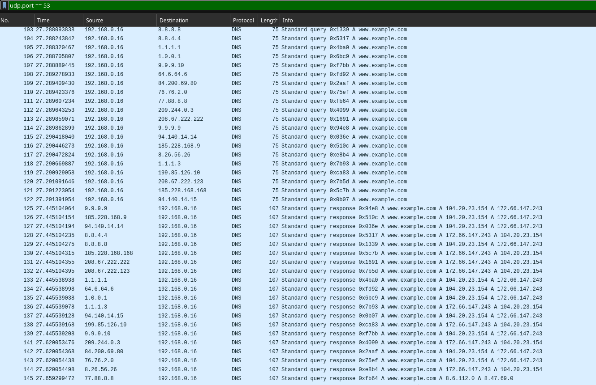
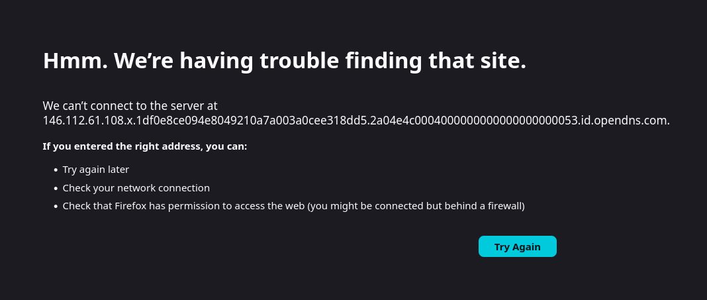

# Trabalho 1 — Análise de DNS: Censura, Desempenho e Privacidade

**Disciplina:** Laboratório de Redes de Computadores  
**Instituição:** PUCRS — Escola Politécnica  
**Data:** 18/05/2025

---

## 1. Descrição da Ferramenta

`dns-scanner` é uma aplicação de linha de comando em Python que consulta um domínio em múltiplos servidores DNS simultaneamente, detecta bloqueios e avalia desempenho. O protocolo DNS é implementado do zero, sem bibliotecas de abstração — toda serialização e parsing de mensagens binárias segue a RFC 1035 diretamente via `struct.pack/unpack`.

### Arquitetura

| Módulo | Responsabilidade |
|--------|-----------------|
| `protocol.py` | Serialização e parsing de mensagens DNS binárias (RFC 1035), incluindo compressão de nomes por ponteiros |
| `client.py` | Clientes UDP (porta 53) e DoT/TLS (porta 853, RFC 7858) |
| `scanner.py` | Configuração de servidores e domínios, varredura paralela, detecção de bloqueio, testes de desempenho |
| `cli.py` | Interface de linha de comando com saída formatada e exportação CSV |

### Detecção de bloqueio

A ferramenta identifica quatro categorias de bloqueio comparando cada resposta com o consenso dos servidores sem filtragem:

- **NXDOMAIN** — quando a maioria dos servidores resolve o domínio normalmente
- **REFUSED** — servidor recusa explicitamente a consulta
- **IP divergente** — IP retornado difere do consenso (possível redirecionamento para página de aviso)
- **Endereço nulo** — resposta com `0.0.0.0` ou `127.0.0.1`

> Instruções de instalação e uso estão no `README.md`. Os resultados brutos estão nos arquivos `dados_bloqueio.csv`, `dados_perf.csv` e `dados_dot_perf.csv`.

---

## 2. Parte 1 — Scanner DNS sobre UDP

### 2.1 Tabelas Comparativas de Resolução por Domínio

As tabelas a seguir apresentam o resultado de uma única consulta por servidor para cada domínio. A coluna **Bloqueio** indica detecção de bloqueio ou manipulação pela ferramenta.

#### www.example.com (controle)

| Servidor | Filtro | RCODE | IPs Retornados | Bloqueio |
|----------|--------|-------|---------------|---------|
| Google | none | NOERROR | 104.20.23.154, 172.66.147.243 | — |
| Google (secondary) | none | NOERROR | 172.66.147.243, 104.20.23.154 | — |
| Cloudflare | none | NOERROR | 172.66.147.243, 104.20.23.154 | — |
| Cloudflare (secondary) | none | NOERROR | 104.20.23.154, 172.66.147.243 | — |
| Quad9 (no filter) | none | NOERROR | 104.20.23.154, 172.66.147.243 | — |
| Verisign | none | NOERROR | 104.20.23.154, 172.66.147.243 | — |
| Control D | none | NOERROR | 104.20.23.154, 172.66.147.243 | — |
| DNS.Watch | none | NOERROR | 104.20.23.154, 172.66.147.243 | — |
| **Yandex DNS** | **none** | **NOERROR** | **8.6.112.0, 8.47.69.0** | **IP divergente** |
| Level3 | none | NOERROR | 104.20.23.154, 172.66.147.243 | — |
| Quad9 | security | NOERROR | 104.20.23.154, 172.66.147.243 | — |
| OpenDNS | security | NOERROR | 172.66.147.243, 104.20.23.154 | — |
| CleanBrowsing Security | security | NOERROR | 172.66.147.243, 104.20.23.154 | — |
| AdGuard DNS | security | NOERROR | 104.20.23.154, 172.66.147.243 | — |
| Comodo Secure | security | NOERROR | 172.66.147.243, 104.20.23.154 | — |
| Norton ConnectSafe | security | NOERROR | 172.66.147.243, 104.20.23.154 | — |
| Cloudflare Family | family | NOERROR | 104.20.23.154, 172.66.147.243 | — |
| OpenDNS FamilyShield | family | NOERROR | 104.20.23.154, 172.66.147.243 | — |
| CleanBrowsing Family | family | NOERROR | 104.20.23.154, 172.66.147.243 | — |
| AdGuard Family | family | NOERROR | 172.66.147.243, 104.20.23.154 | — |

> Resultado esperado: nenhum servidor deveria bloquear. O Yandex DNS retornou IPs fora do consenso (8.6.x.x), o que pode indicar redirecionamento regional ou erro de roteamento.

#### www.pucrs.br (controle regional)

| Servidor | Filtro | RCODE | IPs Retornados | Bloqueio |
|----------|--------|-------|---------------|---------|
| Google | none | NOERROR | 104.18.21.134, 104.18.20.134 | — |
| Google (secondary) | none | NOERROR | 104.18.21.134, 104.18.20.134 | — |
| Cloudflare | none | NOERROR | 104.18.21.134, 104.18.20.134 | — |
| Cloudflare (secondary) | none | NOERROR | 104.18.20.134, 104.18.21.134 | — |
| Quad9 (no filter) | none | NOERROR | 104.18.20.134, 104.18.21.134 | — |
| Verisign | none | NOERROR | 104.18.21.134, 104.18.20.134 | — |
| Control D | none | NOERROR | 104.18.20.134, 104.18.21.134 | — |
| DNS.Watch | none | TIMEOUT | — | Timeout |
| **Yandex DNS** | **none** | **NOERROR** | **8.6.112.0, 8.47.69.0** | **IP divergente** |
| Level3 | none | NOERROR | 104.18.21.134, 104.18.20.134 | — |
| Quad9 | security | NOERROR | 104.18.21.134, 104.18.20.134 | — |
| OpenDNS | security | NOERROR | 104.18.21.134, 104.18.20.134 | — |
| CleanBrowsing Security | security | NOERROR | 104.18.20.134, 104.18.21.134 | — |
| AdGuard DNS | security | NOERROR | 104.18.21.134, 104.18.20.134 | — |
| Comodo Secure | security | NOERROR | 104.18.20.134, 104.18.21.134 | — |
| Norton ConnectSafe | security | NOERROR | 104.18.20.134, 104.18.21.134 | — |
| Cloudflare Family | family | NOERROR | 104.18.20.134, 104.18.21.134 | — |
| OpenDNS FamilyShield | family | NOERROR | 104.18.21.134, 104.18.20.134 | — |
| CleanBrowsing Family | family | NOERROR | 104.18.20.134, 104.18.21.134 | — |
| AdGuard Family | family | NOERROR | 104.18.21.134, 104.18.20.134 | — |

> Nenhum servidor bloqueou www.pucrs.br. O Yandex DNS voltou a apresentar IPs divergentes (8.6.x.x), padrão consistente com seu comportamento no www.example.com.

#### www.google.com (controle adicional)

| Servidor | Filtro | RCODE | IPs Retornados | Bloqueio |
|----------|--------|-------|---------------|---------|
| Google | none | NOERROR | 142.251.x.119 (8 IPs) | — |
| Google (secondary) | none | NOERROR | 142.251.x.119 (8 IPs) | — |
| Cloudflare | none | NOERROR | 142.251.x.119 (8 IPs) | — |
| Cloudflare (secondary) | none | NOERROR | 142.251.x.119 (8 IPs) | — |
| Quad9 (no filter) | none | NOERROR | 142.251.x.119 (8 IPs) | — |
| Verisign | none | NOERROR | 142.251.x.119 (8 IPs) | — |
| Control D | none | NOERROR | 142.251.x.119 (8 IPs) | — |
| DNS.Watch | none | NOERROR | 142.251.x.119 (8 IPs) | — |
| Yandex DNS | none | NOERROR | 142.251.x.119 (8 IPs) | — |
| Level3 | none | NOERROR | 142.251.x.119 (8 IPs) | — |
| Quad9 | security | NOERROR | 142.251.x.119 (8 IPs) | — |
| OpenDNS | security | NOERROR | 142.251.x.119 (8 IPs) | — |
| CleanBrowsing Security | security | NOERROR | 142.251.x.119 (8 IPs) | — |
| AdGuard DNS | security | NOERROR | 142.251.x.119 (8 IPs) | — |
| Comodo Secure | security | NOERROR | 142.251.x.119 (8 IPs) | — |
| Norton ConnectSafe | security | NOERROR | 142.251.x.119 (8 IPs) | — |
| **Cloudflare Family** | **family** | **NOERROR** | **216.239.38.120** | **IP divergente (SafeSearch)** |
| OpenDNS FamilyShield | family | NOERROR | 142.251.x.119 (8 IPs) | — |
| **CleanBrowsing Family** | **family** | **NOERROR** | **216.239.38.120** | **IP divergente (SafeSearch)** |
| **AdGuard Family** | **family** | **NOERROR** | **216.239.38.120** | **IP divergente (SafeSearch)** |

> Cloudflare Family, CleanBrowsing Family e AdGuard Family retornam `216.239.38.120` — o IP do Google SafeSearch — em vez dos IPs normais. Trata-se de uma forma de filtragem que força o modo SafeSearch no Google, redirecionando para uma versão restrita dos resultados de pesquisa. Não é um bloqueio, mas sim uma manipulação da resposta DNS para impor uma política de conteúdo.

#### internetbadguys.com (domínio de teste OpenDNS)

| Servidor | Filtro | RCODE | IPs Retornados | Bloqueio |
|----------|--------|-------|---------------|---------|
| Google | none | NOERROR | 146.112.59.12 | — |
| Google (secondary) | none | NOERROR | 146.112.59.12 | — |
| Cloudflare | none | NOERROR | 146.112.59.12 | — |
| Cloudflare (secondary) | none | NOERROR | 146.112.59.12 | — |
| Quad9 (no filter) | none | NOERROR | 146.112.59.12 | — |
| Verisign | none | NOERROR | 146.112.59.12 | — |
| Control D | none | NOERROR | 146.112.59.12 | — |
| DNS.Watch | none | TIMEOUT | — | Timeout |
| Yandex DNS | none | NOERROR | 146.112.59.12 | — |
| Level3 | none | NOERROR | 146.112.59.12 | — |
| Quad9 | security | NOERROR | 146.112.59.12 | — |
| **OpenDNS** | **security** | **NOERROR** | **146.112.61.108** | **IP divergente (redirect)** |
| **CleanBrowsing Security** | **security** | **NXDOMAIN** | — | **NXDOMAIN** |
| AdGuard DNS | security | NOERROR | 146.112.59.12 | — |
| Comodo Secure | security | NOERROR | 146.112.59.12 | — |
| Norton ConnectSafe | security | NOERROR | 146.112.59.12 | — |
| Cloudflare Family | family | NOERROR | 146.112.59.12 | — |
| **OpenDNS FamilyShield** | **family** | **NOERROR** | **146.112.61.108** | **IP divergente (redirect)** |
| **CleanBrowsing Family** | **family** | **NXDOMAIN** | — | **NXDOMAIN** |
| AdGuard Family | family | NOERROR | 146.112.59.12 | — |

> O domínio `internetbadguys.com` é propriedade da Cisco/OpenDNS e seu IP real é `146.112.59.12`. O OpenDNS e FamilyShield redirecionam para `146.112.61.108` (página de bloqueio), enquanto CleanBrowsing retorna NXDOMAIN.

#### reddit.com

| Servidor | Filtro | RCODE | IPs Retornados | Bloqueio |
|----------|--------|-------|---------------|---------|
| Google | none | NOERROR | 151.101.x.140 (4 IPs) | — |
| Google (secondary) | none | NOERROR | 151.101.x.140 (4 IPs) | — |
| Cloudflare | none | NOERROR | 151.101.x.140 (4 IPs) | — |
| Cloudflare (secondary) | none | NOERROR | 151.101.x.140 (4 IPs) | — |
| Quad9 (no filter) | none | NOERROR | 151.101.x.140 (4 IPs) | — |
| Verisign | none | NOERROR | 151.101.x.140 (4 IPs) | — |
| Control D | none | NOERROR | 151.101.x.140 (4 IPs) | — |
| DNS.Watch | none | NOERROR | 151.101.x.140 (4 IPs) | — |
| Yandex DNS | none | NOERROR | 151.101.x.140 (4 IPs) | — |
| Level3 | none | NOERROR | 151.101.x.140 (4 IPs) | — |
| Quad9 | security | NOERROR | 151.101.x.140 (4 IPs) | — |
| OpenDNS | security | NOERROR | 151.101.x.140 (4 IPs) | — |
| CleanBrowsing Security | security | NOERROR | 151.101.x.140 (4 IPs) | — |
| AdGuard DNS | security | NOERROR | 151.101.x.140 (4 IPs) | — |
| Comodo Secure | security | NOERROR | 151.101.x.140 (4 IPs) | — |
| Norton ConnectSafe | security | NOERROR | 151.101.x.140 (4 IPs) | — |
| Cloudflare Family | family | NOERROR | 151.101.x.140 (4 IPs) | — |
| OpenDNS FamilyShield | family | NOERROR | 151.101.x.140 (4 IPs) | — |
| **CleanBrowsing Family** | **family** | **NXDOMAIN** | — | **NXDOMAIN** |
| AdGuard Family | family | NOERROR | 151.101.x.140 (4 IPs) | — |

> Apenas CleanBrowsing Family bloqueia reddit.com, por considerar redes sociais inadequadas para o público infantil.

#### tinder.com

| Servidor | Filtro | RCODE | IPs Retornados | Bloqueio |
|----------|--------|-------|---------------|---------|
| Google | none | NOERROR | 52.84.150.x (4 IPs) | — |
| Google (secondary) | none | NOERROR | 52.84.150.x (4 IPs) | — |
| Cloudflare | none | NOERROR | 52.84.150.x (4 IPs) | — |
| Cloudflare (secondary) | none | NOERROR | 52.84.150.x (4 IPs) | — |
| Quad9 (no filter) | none | NOERROR | 52.84.150.x (4 IPs) | — |
| Verisign | none | NOERROR | 52.84.150.x (4 IPs) | — |
| Control D | none | NOERROR | 52.84.150.x (4 IPs) | — |
| DNS.Watch | none | TIMEOUT | — | Timeout |
| Yandex DNS | none | NOERROR | 52.84.150.x (4 IPs) | — |
| Level3 | none | NOERROR | 52.84.150.x (4 IPs) | — |
| Quad9 | security | NOERROR | 52.84.150.x (4 IPs) | — |
| OpenDNS | security | NOERROR | 52.84.150.x (4 IPs) | — |
| CleanBrowsing Security | security | NOERROR | 52.84.150.x (4 IPs) | — |
| AdGuard DNS | security | NOERROR | 52.84.150.x (4 IPs) | — |
| Comodo Secure | security | NOERROR | 52.84.150.x (4 IPs) | — |
| Norton ConnectSafe | security | NOERROR | 52.84.150.x (4 IPs) | — |
| Cloudflare Family | family | NOERROR | 52.84.150.x (4 IPs) | — |
| OpenDNS FamilyShield | family | NOERROR | 52.84.150.x (4 IPs) | — |
| **CleanBrowsing Family** | **family** | **NXDOMAIN** | — | **NXDOMAIN** |
| **AdGuard Family** | **family** | **NOERROR** | **94.140.14.35** | **IP divergente (block page)** |

#### thepiratebay.org

| Servidor | Filtro | RCODE | IPs Retornados | Bloqueio |
|----------|--------|-------|---------------|---------|
| Google | none | NOERROR | 162.159.136.6, 162.159.137.6 | — |
| Google (secondary) | none | NOERROR | 162.159.136.6, 162.159.137.6 | — |
| Cloudflare | none | NOERROR | 162.159.136.6, 162.159.137.6 | — |
| Cloudflare (secondary) | none | NOERROR | 162.159.136.6, 162.159.137.6 | — |
| Quad9 (no filter) | none | NOERROR | 162.159.136.6, 162.159.137.6 | — |
| Verisign | none | NOERROR | 162.159.136.6, 162.159.137.6 | — |
| Control D | none | NOERROR | 162.159.136.6, 162.159.137.6 | — |
| DNS.Watch | none | TIMEOUT | — | Timeout |
| Yandex DNS | none | NOERROR | 162.159.136.6, 162.159.137.6 | — |
| Level3 | none | NOERROR | 162.159.136.6, 162.159.137.6 | — |
| Quad9 | security | NOERROR | 162.159.136.6, 162.159.137.6 | — |
| OpenDNS | security | NOERROR | 162.159.136.6, 162.159.137.6 | — |
| CleanBrowsing Security | security | NOERROR | 162.159.136.6, 162.159.137.6 | — |
| AdGuard DNS | security | NOERROR | 162.159.136.6, 162.159.137.6 | — |
| Comodo Secure | security | NOERROR | 162.159.136.6, 162.159.137.6 | — |
| Norton ConnectSafe | security | NOERROR | 162.159.136.6, 162.159.137.6 | — |
| **Cloudflare Family** | **family** | **NOERROR** | **0.0.0.0** | **Endereço nulo** |
| OpenDNS FamilyShield | family | NOERROR | 162.159.136.6, 162.159.137.6 | — |
| **CleanBrowsing Family** | **family** | **NXDOMAIN** | — | **NXDOMAIN** |
| AdGuard Family | family | NOERROR | 162.159.136.6, 162.159.137.6 | — |

> Cloudflare Family bloqueia via endereço nulo (`0.0.0.0`), enquanto CleanBrowsing Family usa NXDOMAIN. Os demais filtros de segurança — inclusive Quad9, OpenDNS e AdGuard — não bloquearam o The Pirate Bay.

#### polymarket.com (bloqueado no Brasil por ordem judicial)

| Servidor | Filtro | RCODE | IPs Retornados | Bloqueio |
|----------|--------|-------|---------------|---------|
| Google | none | NOERROR | 64.239.109.1 | — |
| Google (secondary) | none | NOERROR | 64.239.109.1 | — |
| Cloudflare | none | NOERROR | 64.239.109.1 | — |
| Cloudflare (secondary) | none | NOERROR | 64.239.109.1 | — |
| Quad9 (no filter) | none | NOERROR | 64.239.109.1 | — |
| Verisign | none | NOERROR | 64.239.109.1 | — |
| Control D | none | NOERROR | 64.239.109.1 | — |
| DNS.Watch | none | TIMEOUT | — | Timeout |
| Yandex DNS | none | NOERROR | 64.239.109.1 | — |
| Level3 | none | NOERROR | 64.239.109.1 | — |
| Quad9 | security | NOERROR | 64.239.109.1 | — |
| OpenDNS | security | NOERROR | 64.239.109.1 | — |
| CleanBrowsing Security | security | NOERROR | 64.239.109.1 | — |
| AdGuard DNS | security | NOERROR | 64.239.109.1 | — |
| Comodo Secure | security | TIMEOUT | — | Timeout |
| Norton ConnectSafe | security | NOERROR | 64.239.109.1 | — |
| Cloudflare Family | family | NOERROR | 64.239.109.1 | — |
| OpenDNS FamilyShield | family | NOERROR | 64.239.109.1 | — |
| CleanBrowsing Family | family | NOERROR | 64.239.109.1 | — |
| AdGuard Family | family | NOERROR | 64.239.109.1 | — |

> Nenhum servidor DNS público testado bloqueou polymarket.com. O bloqueio judicial da Anatel é aplicado pelos ISPs brasileiros (Vivo, Claro, TIM, Oi) em seus próprios resolvers, não pelos provedores DNS públicos internacionais.

#### bet365.com (apostas — bloqueado no Brasil)

| Servidor | Filtro | RCODE | IPs Retornados | Bloqueio |
|----------|--------|-------|---------------|---------|
| Google | none | NOERROR | 5.226.179.10 | — |
| Google (secondary) | none | NOERROR | 5.226.179.10 | — |
| Cloudflare | none | NOERROR | 5.226.179.10 | — |
| Cloudflare (secondary) | none | NOERROR | 5.226.179.10 | — |
| Quad9 (no filter) | none | NOERROR | 5.226.179.10 | — |
| Verisign | none | NOERROR | 5.226.179.10 | — |
| Control D | none | NOERROR | 5.226.179.10 | — |
| DNS.Watch | none | NOERROR | 5.226.179.10 | — |
| Yandex DNS | none | NOERROR | 5.226.179.10 | — |
| Level3 | none | NOERROR | 5.226.179.10 | — |
| Quad9 | security | NOERROR | 5.226.179.10 | — |
| OpenDNS | security | NOERROR | 5.226.179.10 | — |
| CleanBrowsing Security | security | NOERROR | 5.226.179.10 | — |
| AdGuard DNS | security | NOERROR | 5.226.179.10 | — |
| Comodo Secure | security | TIMEOUT | — | Timeout |
| Norton ConnectSafe | security | NOERROR | 5.226.179.10 | — |
| Cloudflare Family | family | NOERROR | 5.226.179.10 | — |
| OpenDNS FamilyShield | family | NOERROR | 5.226.179.10 | — |
| CleanBrowsing Family | family | NOERROR | 5.226.179.10 | — |
| AdGuard Family | family | NOERROR | 5.226.179.10 | — |

> Assim como polymarket.com, nenhum servidor DNS público bloqueou bet365.com. O bloqueio judicial é implementado pelos ISPs brasileiros. Comodo Secure apresentou timeout em ambos os domínios.

### 2.2 Síntese dos Bloqueios

| Domínio | CleanBrowsing Sec. | CleanBrowsing Fam. | OpenDNS | OpenDNS FamilyShield | AdGuard DNS | AdGuard Family | Cloudflare Family |
|---------|:------------------:|:------------------:|:-------:|:--------------------:|:-----------:|:--------------:|:-----------------:|
| internetbadguys.com | NXDOMAIN | NXDOMAIN | Redirect | Redirect | — | — | — |
| reddit.com | — | NXDOMAIN | — | — | — | — | — |
| tinder.com | — | NXDOMAIN | — | — | — | Block IP | — |
| thepiratebay.org | — | NXDOMAIN | — | — | — | — | 0.0.0.0 |

---

### 2.3 Ranking de Desempenho

Teste realizado com **10 consultas** por servidor para o domínio `www.example.com`.

| # | Servidor | Filtro | Média (ms) | Mín (ms) | Máx (ms) | Perda |
|---|----------|--------|:----------:|:--------:|:--------:|:-----:|
| 1 | AdGuard Family | family | 47,5 | 22,7 | 127,4 | 0% |
| 2 | Cloudflare Family | family | 60,3 | 15,3 | 87,4 | 0% |
| 3 | Norton ConnectSafe | security | 63,2 | 24,6 | 132,0 | 0% |
| 4 | OpenDNS FamilyShield | family | 64,2 | 28,9 | 116,4 | 0% |
| 5 | AdGuard DNS | security | 70,0 | 22,8 | 148,0 | 0% |
| 6 | CleanBrowsing Family | family | 72,5 | 22,8 | 147,6 | 0% |
| 7 | CleanBrowsing Security | security | 80,9 | 24,7 | 147,5 | 0% |
| 8 | Cloudflare (secondary) | none | 94,8 | 15,8 | 234,2 | 0% |
| 9 | OpenDNS | security | 97,1 | 29,3 | 191,5 | 0% |
| 10 | Quad9 | security | 109,8 | 22,8 | 235,3 | 0% |
| 11 | Cloudflare | none | 118,3 | 14,6 | 235,2 | 0% |
| 12 | Quad9 (no filter) | none | 155,0 | 30,1 | 235,8 | 0% |
| 13 | Verisign | none | 155,0 | 29,9 | 234,9 | 0% |
| 14 | Google (secondary) | none | 155,0 | 34,3 | 234,7 | 0% |
| 15 | Google | none | 155,1 | 35,7 | 234,6 | 0% |
| 16 | Control D | none | 168,5 | 67,4 | 235,1 | 0% |
| 17 | Level3 | none | 206,1 | 137,3 | 278,0 | 0% |
| 18 | Comodo Secure | security | 248,2 | 132,2 | 378,4 | **40%** |
| 19 | DNS.Watch | none | 278,1 | 199,3 | 411,1 | **40%** |
| 20 | Yandex DNS | none | 618,3 | 476,0 | 710,1 | **30%** |

---

## 3. Parte 2 — Análise de Tráfego com Wireshark

### 3.1 Captura de Tráfego UDP (Porta 53)

A captura foi realizada com filtro `udp.port == 53` durante a execução de `uv run dns-scanner scan www.example.com` e `uv run dns-scanner scan internetbadguys.com`.

#### Lista de pacotes capturados

A captura mostra múltiplas consultas e respostas simultâneas, geradas pela varredura paralela da ferramenta. Cada par query/response é visível na coluna Info, que exibe o domínio consultado em texto claro. Os endereços IP de destino correspondem a cada servidor DNS testado.

**Observações:**
- **Endereços de origem:** IP local do host (192.168.0.x), porta UDP efêmera (> 1024)
- **Endereços de destino:** IP de cada servidor DNS (8.8.8.8, 1.1.1.1, 9.9.9.9, etc.), porta 53
- **Tamanho dos pacotes:** consultas (~75 bytes) e respostas (~95–160 bytes)
- **O domínio consultado é completamente visível** na captura sem qualquer decodificação especial

#### Consulta DNS (query)

Detalhe de uma consulta DNS para `www.example.com` enviada ao servidor Google (8.8.8.8):

- **Frame:** 75 bytes, interface `wlp2s0`
- **Camada de transporte:** UDP, porta de origem 42047 → porta de destino 53
- **Transaction ID:** `0x1339` (identificador para correlacionar query/response)
- **Flags:** Standard query, Recursion Desired
- **Seção Questions:** `www.example.com`, tipo A, classe IN

O domínio consultado (`www.example.com`) aparece em texto claro no payload UDP, visível a qualquer intermediário na rede.

#### Resposta DNS normal (NOERROR)

Resposta do servidor Google (8.8.8.8) para `www.example.com`:

- **Frame:** 107 bytes
- **Transaction ID:** `0x1339` (correspondente à query)
- **RCODE:** No error (0)
- **Answer RRs:** 2 registros A
  - `www.example.com` → `104.20.23.154`
  - `www.example.com` → `172.66.147.243`
- **Tempo de resposta:** 157 ms

#### Resposta de bloqueio — NXDOMAIN

Resposta do servidor **CleanBrowsing Family (185.228.168.168)** para `internetbadguys.com`:

- **Frame:** 153 bytes
- **RCODE:** No such name (3) — **NXDOMAIN**
- **Answer RRs:** 0 (sem registros A)
- **Authority:** registro SOA apontando para `cleanbrowsing.rpz.noc.org`, confirmando que o bloqueio é via RPZ (Response Policy Zone)
- **Tempo de resposta:** 55 ms

O servidor responde como se o domínio não existisse, mesmo que ele exista e seja resolvível por outros servidores.

#### Resposta de bloqueio — Redirecionamento (IP divergente)

Resposta do servidor **OpenDNS (208.67.222.222)** para `internetbadguys.com`:

- **Frame:** 95 bytes
- **RCODE:** No error (0) — formalmente "bem-sucedida"
- **Answer RRs:** 1 registro A
  - `internetbadguys.com` → **`146.112.61.108`** (página de bloqueio OpenDNS)
- O IP retornado difere do consenso (`146.112.59.12`), caracterizando **IP divergente**

Ao tentar acessar `internetbadguys.com` no navegador com o IP retornado pelo OpenDNS, o browser tentou conectar ao servidor em `146.112.61.108` — que responde com um redirect para a página de aviso do OpenDNS em `id.opendns.com`. Como a rede local não estava usando o OpenDNS como resolver, esse domínio não resolveu e o browser exibiu erro de conexão:

### 3.2 Análise do Tráfego UDP

| Aspecto | Observação |
|---------|-----------|
| IPs de origem e destino | Completamente visíveis — src: IP local, dst: IP do servidor DNS |
| Portas utilizadas | UDP 53 (destino); porta efêmera (origem) |
| Conteúdo das consultas | **Totalmente visível** — domínio em texto claro no payload |
| Conteúdo das respostas | **Totalmente visível** — RCODE e IPs legíveis |
| Tamanho médio de uma consulta | ~75 bytes |
| Tamanho médio de uma resposta | ~95–160 bytes |
| Pacotes por consulta completa | 2 (1 query + 1 response) |

**Informações que um intermediário pode extrair:** qualquer roteador, ISP ou atacante com acesso ao caminho de rede pode observar todos os domínios consultados, os servidores utilizados, os IPs retornados e os tempos de resposta — sem precisar de nenhuma chave ou decodificação especial.

---

## 4. Parte 3 — DNS over TLS (DoT)

### 4.1 Implementação

A ferramenta implementa um cliente DoT conforme a RFC 7858:

1. Estabelece conexão TCP na porta 853
2. Realiza handshake TLS usando o módulo `ssl` da biblioteca padrão do Python
3. Envia a mensagem DNS binária precedida por um prefixo de 2 bytes com o tamanho (`struct.pack(">H", len(msg))`)
4. Lê a resposta com o mesmo prefixo de 2 bytes para determinar o tamanho

Servidores testados: Google (`dns.google`), Cloudflare (`one.one.one.one`), Quad9 (`dns.quad9.net`).

### 4.2 Comparação de Desempenho UDP vs DoT

Teste realizado com **10 consultas** para `www.example.com` usando cada protocolo.

| Servidor | Protocolo | Média (ms) | Mín (ms) | Máx (ms) | Overhead DoT |
|----------|-----------|:----------:|:--------:|:--------:|:------------:|
| Google | UDP | 142,1 | 27,4 | 235,7 | — |
| Google DoT | DoT | 413,9 | 177,1 | 798,5 | +191% |
| Cloudflare | UDP | 92,9 | 15,3 | 234,7 | — |
| Cloudflare DoT | DoT | 453,0 | 255,6 | 792,7 | +388% |
| Quad9 | UDP | 144,0 | 28,2 | 235,7 | — |
| Quad9 DoT | DoT | 383,7 | 152,0 | 780,5 | +166% |

O DoT apresenta latência média **2,7× a 4,9×** maior que o UDP tradicional, devido ao custo do handshake TCP + TLS (tipicamente 200–400 ms a mais por conexão).

### 4.3 Análise de Tráfego DoT com Wireshark

#### Lista de pacotes DoT

A captura com filtro `tcp.port == 853` mostra uma sequência bem diferente do UDP:

1. **TCP Handshake:** SYN → SYN-ACK → ACK (3 pacotes antes de qualquer dado DNS)
2. **TLS Handshake:** Client Hello → Server Hello → Certificate → Finished (vários pacotes)
3. **Application Data:** pacotes criptografados com o conteúdo DNS

#### TLS Handshake

O Client Hello revela metadados do handshake TLS: versão (TLS 1.3), cipher suites suportadas, extensões (SNI com o hostname do servidor DNS, ALPN, etc.). O **SNI (Server Name Indication)** pode revelar o hostname do servidor DoT (`dns.google`, `one.one.one.one`), mas não o domínio consultado.

#### Application Data (payload cifrado)

O pacote de dados da consulta DNS:

- **Porta de destino:** 853 (TCP)
- **Camada TLS:** `TLSv1.3 Record Layer: Application Data Protocol: Domain Name System`
- **Encrypted Application Data:** `c2f4e1610616a89e08f1d69419f3a623...` — **completamente ilegível**

O Wireshark identifica que o protocolo de aplicação é DNS (pelo SNI/ALPN), mas **não consegue decodificar o conteúdo** — o domínio consultado e a resposta são invisíveis.

### 4.4 Comparação UDP vs DoT — Tráfego

| Aspecto | DNS/UDP | DNS/TLS (DoT) |
|---------|:-------:|:-------------:|
| Domínio consultado visível | **Sim** | **Não** |
| IP retornado visível | **Sim** | **Não** |
| Servidor DNS identificável | Sim (IP de destino) | Sim (IP + SNI) |
| Pacotes por consulta | ~2 | ~10–15 (TCP+TLS+DNS) |
| Bytes por consulta | ~230 | ~2.000–4.000 |
| Porta | UDP 53 | TCP 853 |

---

## 5. Análise Crítica — Questões

### 7.1 Análise de Bloqueio

**Quais servidores bloquearam quais domínios e com qual técnica?**

- **CleanBrowsing Family:** bloqueia `internetbadguys.com`, `reddit.com`, `tinder.com` e `thepiratebay.org` via **NXDOMAIN** (simula que o domínio não existe).
- **CleanBrowsing Security:** bloqueia `internetbadguys.com` via **NXDOMAIN**.
- **OpenDNS / FamilyShield:** bloqueia `internetbadguys.com` via **redirecionamento de IP** (retorna `146.112.61.108`, uma página de aviso, em vez do IP real).
- **AdGuard Family:** bloqueia `tinder.com` via **IP de bloqueio** (`94.140.14.35`).
- **Cloudflare Family:** bloqueia `thepiratebay.org` via **endereço nulo** (`0.0.0.0`).

**Existe consenso entre filtros da mesma categoria?**

Não há consenso completo. Dentro da categoria "family", CleanBrowsing é o mais restritivo (bloqueia Reddit, Tinder, The Pirate Bay), enquanto Cloudflare Family e OpenDNS FamilyShield são mais permissivos. AdGuard Family fica no meio-termo. Cada provedor define suas próprias listas de bloqueio.

**É possível contornar um bloqueio DNS trocando o servidor?**

Sim. Como demonstrado na tabela de internetbadguys.com, trocar de OpenDNS (que bloqueia) para Google, Cloudflare ou Quad9 (sem filtro) resolve o domínio normalmente. O bloqueio por DNS é trivialmente contornável por qualquer usuário que saiba configurar um servidor DNS alternativo.

### 7.2 Análise de Desempenho

**Quais servidores apresentam menor latência?**

Os servidores com menor latência média foram **AdGuard Family (47,5 ms)**, **Cloudflare Family (60,3 ms)** e **Norton ConnectSafe (63,2 ms)**. Em geral, servidores europeus (AdGuard, CleanBrowsing) apresentaram latências menores neste teste, provavelmente por terem infraestrutura com pontos de presença mais próximos geograficamente (ou por cache mais eficiente).

**O que explica as diferenças?**

A latência DNS depende principalmente de: (1) distância geográfica ao servidor, (2) infraestrutura de rede (anycast vs. unicast), (3) eficiência de cache. Yandex DNS (618 ms, 30% de perda) e DNS.Watch (278 ms, 40% de perda) estão claramente em rotas mais longas ou com problemas de roteamento a partir desta rede.

**A filtragem afeta o tempo de resposta?**

Os dados não mostram correlação clara. Os servidores de filtragem familiar lideraram o ranking de desempenho, o que sugere que a filtragem não introduz latência significativa — as listas de bloqueio são consultadas localmente no servidor, sem round-trips adicionais.

### 7.3 Análise de Tráfego (Parte 2)

**O conteúdo das consultas DNS é visível?**

Sim, completamente. O DNS/UDP opera em texto claro: o domínio consultado, o servidor utilizado, os IPs retornados e até o RCODE de bloqueio são visíveis sem nenhuma decodificação especial, como demonstrado nas capturas do Wireshark.

**Informações que um intermediário poderia extrair:**

- Histórico completo de navegação (todos os domínios acessados)
- Servidores DNS utilizados pelo usuário
- Respostas recebidas (IPs, bloqueios)
- Padrões temporais de uso

### 7.4 Questões para Reflexão

**1. O DNS tradicional (UDP, porta 53) oferece privacidade ao usuário?**

Não. O DNS/UDP opera em texto claro — qualquer entidade com acesso ao caminho de rede (ISP, roteador da empresa, ponto de acesso Wi-Fi público) pode ver todos os domínios consultados. As capturas do Wireshark confirmam isso: o domínio aparece literalmente legível na coluna Info sem nenhum processamento especial.

**2. O bloqueio por DNS é eficaz como mecanismo de censura?**

É um mecanismo de baixa eficácia técnica, mas de alto alcance prático para usuários não técnicos. Contorná-lo é trivial: basta configurar um servidor DNS alternativo (ex: 1.1.1.1 ou 8.8.8.8) ou usar DoT/DoH para evitar interceptação. No entanto, a maioria dos usuários comuns não sabe fazer isso. Para usuários técnicos, o bloqueio por DNS é ineficaz.

**3. Qual a diferença entre um DNS público e um DNS de ISP?**

Um DNS de ISP (como o fornecido automaticamente via DHCP) é controlado pelo provedor de acesso, que pode aplicar bloqueios por ordem judicial, monitorar consultas e até injetar respostas falsas. Um DNS público (Google, Cloudflare) é operado por empresas globais com políticas próprias de privacidade e filtragem, geralmente mais transparentes. Em ambos os casos, sem criptografia (DoT/DoH), as consultas trafegam em texto claro e podem ser observadas por intermediários.

Atualmente utilizo o DNS configurado pelo roteador doméstico (`192.168.0.1`), que repassa as consultas ao DNS do ISP atribuído via DHCP. Trata-se portanto de um DNS de ISP — sujeito a bloqueios judiciais como os aplicados pela Anatel a polymarket.com e bet365.com, diferentemente dos servidores DNS públicos testados neste trabalho, que não aplicaram nenhum desses bloqueios.

**4. Se dois servidores retornam IPs diferentes para o mesmo domínio, como determinar qual é legítimo?**

A abordagem mais confiável é a **maioria estatística**: se 18 de 20 servidores independentes retornam o mesmo IP e 2 retornam um IP diferente, os 18 provavelmente estão corretos. Adicionalmente, pode-se verificar o registro DNS autoritativo via `whois`, consultar o RDAP do IP para confirmar que pertence à organização esperada, ou usar DNSSEC (quando disponível) para validação criptográfica da resposta.

### 7.5 Questões Adicionais — Parte 3 (DoT)

**5. Qual abordagem apresenta menor latência: DNS/UDP ou DNS/TLS?**

DNS/UDP é significativamente mais rápido. Nos testes, o UDP apresentou média de ~93–144 ms, enquanto o DoT ficou em ~384–453 ms para os mesmos servidores. O overhead é de 2,7× a 4,9×, explicado pelo custo do handshake TCP (1,5 RTTs) somado ao handshake TLS 1.3 (1 RTT adicional). Em conexões já estabelecidas (session resumption), o overhead seria menor, mas a ferramenta abre uma nova conexão por consulta.

**6. O conteúdo das consultas DNS é visível no tráfego DoT capturado pelo Wireshark?**

Não. Como mostrado na captura `dot_application_data.png`, o payload DNS está encriptado dentro do registro TLS Application Data — o Wireshark exibe apenas a sequência de bytes cifrados, sem revelar o domínio consultado ou a resposta. O único metadado visível é o endereço IP do servidor DoT e, potencialmente, o SNI no Client Hello (que revela apenas o hostname do servidor DNS, não o domínio consultado).

**7. O DoT é mais fácil ou mais difícil de bloquear do que o DNS tradicional?**

É mais fácil de bloquear em um sentido e mais difícil em outro. Um ISP pode bloquear todo o tráfego TCP na porta 853 com uma única regra de firewall, impedindo DoT — isso é mais simples do que bloquear domínios específicos no DNS. Por outro lado, o ISP não pode *manipular* as respostas DoT, pois estão criptografadas e autenticadas pelo certificado TLS do servidor.

**8. Qual protocolo oferece maior privacidade ao usuário?**

DNS/TLS (DoT) oferece substancialmente maior privacidade que o DNS/UDP tradicional. Com DoT, o conteúdo das consultas é invisível a intermediários; apenas o endereço IP do servidor DoT é visível. DoH (DNS over HTTPS, porta 443) seria ainda mais difícil de bloquear, pois seu tráfego é indistinguível de HTTPS normal. Entre DoT e UDP, DoT elimina a capacidade de interceptação passiva do conteúdo das consultas DNS.

---

## 6. Conclusão

A ferramenta desenvolvida demonstrou que o DNS é um mecanismo crítico que afeta tanto a acessibilidade quanto a privacidade dos usuários. Os experimentos revelaram que:

1. **A filtragem DNS é inconsistente**: cada provedor utiliza técnicas e listas diferentes (NXDOMAIN, redirecionamento, endereço nulo), sem padronização entre filtros da mesma categoria.

2. **O bloqueio DNS é facilmente contornável**: trocar o servidor DNS é suficiente para acessar qualquer domínio bloqueado, tornando esse mecanismo ineficaz para usuários técnicos.

3. **O DNS/UDP não oferece privacidade**: todo o histórico de navegação é visível em texto claro para ISPs e outros intermediários.

4. **DoT melhora a privacidade ao custo de latência**: o overhead do handshake TLS (~200–300 ms extra) é o principal inconveniente, mas a confidencialidade das consultas é garantida.

---

*Ferramenta desenvolvida com Python 3.13 e uv. Código-fonte disponível nos arquivos entregues.*
